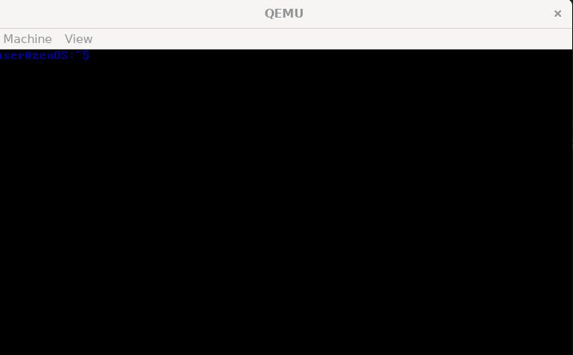
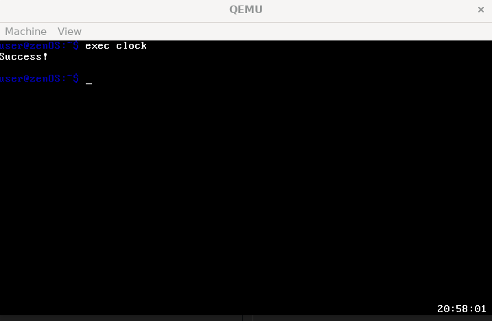

# ZenOS
> Pembuatan sistem operasi "sederhana" dalam rangkah pemenuhan Tugas Besar IF2230 Sistem Operasi

## Table of Contents
- [ZenOS](#zenos)
  - [Table of Contents](#table-of-contents)
  - [General Information](#general-information)
  - [Technologies Used](#technologies-used)
  - [Features](#features)
  - [Screenshots](#screenshots)
  - [Setup](#setup)
  - [Usage](#usage)
  - [Commands](#commands)
  - [Project Status](#project-status)
  - [Room for Improvement](#room-for-improvement)
  - [Contribution Table](#contribution-table)
  - [Acknowledgements](#acknowledgements)
  - [Closing Statements](#closing-statements)


## General Information
- Moshi moshi minnnaa ~~ Watashi wa ZenOS desuu, yoroshuku onegaishimassuu!! ^__^
- Anonee akuu dibuat sama Tjhia, Evelyn , Marvel sama Max untuk tugas Sistem Operasi IF, jadi sayang deh sama mereka~~ >//<


## Technologies Used
- Qemuwu (Qemu)
- UwUsl (WSL)
- GitHubbyyy (GitHub)


## Features
Anoneee watashii punya banyak fitur menarik lohh OwO:
- Filesystem FAT32 (bukan caseoh) ඞ ඞ ඞ ඞ
- Shell yang punya recent commands sama bisa ngedit ketikan lohh~~ (ʘᗩʘ’)
- Clock biar ga kelupaan waktu buat mewing 🧏🤫Bуe~ bye~
- Tidak dilupakan ada teman selama menggunakan OS yang dateng seperti fanum dan menemani waktu edging minnaa


## Screenshots
<br/><br/>

<!-- If you have screenshots you'd like to share, include them here. -->


## Setup
Minnaa kalau mau jadi sigma male 🤫🧏‍♂️ dan menambah rizz level 🥵 maka watashi mudah untuk dipakai loh (eyyo pause 🤨) untuk pengguna architecture x86 apalagi windows. Minna tinggal mengunduh WSL yang cara pengunduhannya klik link ini [૮ ˶ᵔ ᵕ ᵔ˶ ა](https://docs.google.com/document/d/1Zt3yzP_OEiFz8g2lHlpBNNr9qUyXghFNeQlAeQpAaII/edit#heading=h.z69qt6rveqcu).

Terus kalau watashi memiliki vbucks sehingga punya mac maka ikuti langkah [𝕾𝖐𝖎𝖇𝖎𝖉𝖎 𝕿𝖔𝖎𝖑𝖊𝖙](https://docs.google.com/document/d/1ae_Oa9bAdc7qvV7qTsOvSGIus6RocsTJJSOl64Det0o/edit#heading=h.mdl18ntcayin)


## Usage
Minna kalau udah selesai setup jangan lupa clone repo ini ya UwU. Buka repo ini di command line terus masuk ke wsl ya xixixi. Buka di vscode dan ketik ini di terminal

```shell
make all
```

Setelah melakukan itu minna tinggal memencet ctrl + F5 untuk menjalankan akuu

## Commands

Contoh struktur :
```shell
root
│
├── love1
│   └── fileInside.txt
│
├── love2
│   └── love3
│         ├── file1.txt
│         └── buddy.exe
│
└── file1.txt
```
Dore dore udah selesai setup nya ya UwU. Tentu watashi punya beberapa commands yang bisa dipake oWO. Gunakan commands sigma skibidi sebagai berikut

- cd

Fungsi cd yang watashi punya itu bisa masuk ke suatu folder relative pathing dan juga bisa keluar dari folder itu ⸜(｡˃ ᵕ ˂ )⸝♡
````shell
cd <..> 
cd <folder_name>
````

- ls

Pernah gasi minna lupa mewing atau lupa ada apa aja di folder? Nah fungsi ls ini sangat sigma dimana kita bisa liat semua folder atau file yang ada di folder yang sedang di telusuri
````shell
ls
````

- mkdir

Minna mungkin ingin menyembunyikan makanan di folder baru sehingga tidak terkena fanum tax. Maka minna bisa buat folder baru dengan menggunakan fungsi ini
````shell
mkdir <folder_name>
````

- cat

Ingin melihat file.txt yang isinya puisi rizz level 500 yang bisa mendapatkan gyatt 1000 pada *current directory* ? cukup memakai command ini
````shell
cat <file_name_with_extension>
````
- cp

Punya grimace shake yang pengen di copy? gunakanlah command ini:

````shell
cp love1/grimace_shake.txt love2/love3
````
contoh tersebut akan mengcopy grimace_shake dalam love1 ke love3 !

- rm

Punya file Ohio.txt yang ingin di remove? maka bisa gunakan command ini
````shell
rm <file/folder>
````

- mv

Kalau semisal minna mau pindahin file secret, hehe, minna bsia lakukan dengang command mv, command ini relative *root* folder ya !

````shell
mv love1/fileInside.txt love2/love3
````

- find

Mungkin minna pernah membuat file 10/10 gyatt tapi fumble dan lupa lokasinya. Maka bisa menggunakan command ini
````shell
find <file/folder_without_extension>
````

- exec

Minna juga bisa execute sebuah file exe, dengan command ini minna bisa membuat proses loh ! ingat command ini relative *working directory* ya ! Contoh minnna di love2, maka untuk *execute* buddy.exe dapat dilakukan dengan cara berikut:

````shell
exec love3/buddy.exe
````

- ps

Minna juga bisa melihat semua proses yang running/ready loh ! dengan command berikut:
````shell
ps
````

- kill

Akhirnya, minna bisa membunuh sebuah proses berdasarkan *process id* nya

````shell
kill <process_id>
````
## Project Status
Maafkan watashi ya kalau belum 100% bug free karena watashi belum mencapai level 100 skibidi rizz, aku masih harus melalui tahapan yang lebih gyattt


## Room for Improvement

Room for improvement:
- Menjadi skibidi sigma dengan merubah framebuffer menjadi vga

To do:
- Menjadi kai cenat

## Contribution Table
<table>
    <tr>
      <td><b>NIM</b></td>
      <td><b>Nama</b></td>
    </tr>
    <tr>
      <td>13522061</td>
      <td>Maximilian Sulistiyo</td>
    </tr>
    <tr>
      <td>13522075</td>
      <td>Marvel Pangondian</td>
    </tr>
    <tr>
      <td>13522083</td>
      <td>Evelyn Yosiana</td>
    </tr>
    <tr>
      <td>13522103</td>
      <td>Steven Tjhia</td>
    </tr>
</table>


## Acknowledgements
- I thank God for giving us the power to power through this tubes
- Arigato kepada orang tua sehingga kita bisa membeli kopi buat mengerjakan tugas ini


## Closing Statements
- Are you insane because of 6 tubes or are you still sane because holiday is incoming. If the asisten increased the difficulty of the specification and don't delay the deadline then it will be a struggle. but will you lose? Nah, id kms 👉🔴🔵👈🤞🤌🫴🟣


<!-- Optional -->
<!-- ## License -->
<!-- This project is open source and available under the [... License](). -->

<!-- You don't have to include all sections - just the one's relevant to your project -->